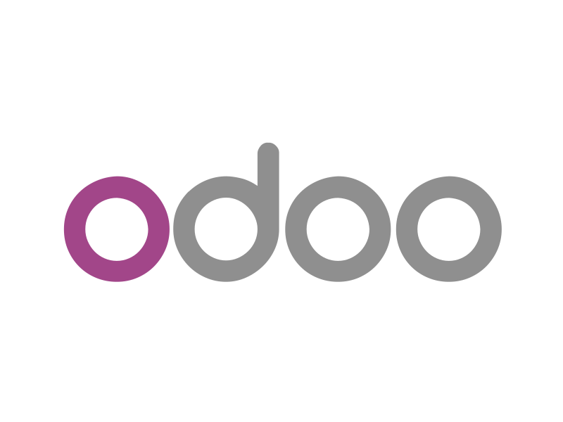

# Odoo <Badge type="tip" text="ERP" />

---



## Odoo, c’est quoi ?

**Odoo** est un logiciel **ERP (Enterprise Resource Planning)** open source qui permet de gérer l’ensemble des processus d’une entreprise à travers une plateforme unique.  
Il intègre différents modules pour la **gestion commerciale, comptable, des ressources humaines, des stocks, des ventes, du marketing**, etc.  

Grâce à son architecture modulaire, Odoo s’adapte aussi bien aux **petites entreprises** qu’aux **grandes organisations**.

---

## Les modules principaux

Voici quelques-uns des modules les plus utilisés dans Odoo :

- **CRM** : pour gérer les relations clients et les opportunités commerciales.  
- **Ventes** : pour créer des devis, bons de commande et factures.  
- **Comptabilité** : pour suivre les paiements, dépenses et rapports financiers.  
- **Inventaire** : pour la gestion des stocks et entrepôts.  
- **Ressources humaines** : pour la paie, la présence, les congés et le recrutement.  
- **Site web & e-commerce** : pour créer un site ou une boutique en ligne intégrée à la gestion interne.

---

## Exemple de module Odoo (Python)

Un module Odoo se compose généralement de fichiers Python et XML.  
Voici un exemple minimal de modèle Odoo en **Python** :

```python
from odoo import models, fields

class ProductCategory(models.Model):
    _name = 'my_module.product_category'
    _description = 'Catégorie de produit personnalisée'

    name = fields.Char(string='Nom de la catégorie', required=True)
    description = fields.Text(string='Description')
    active = fields.Boolean(string='Actif', default=True)
