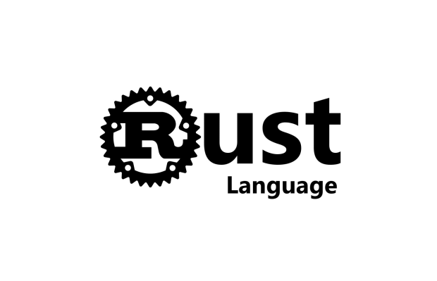

# Rust <Badge type="tip" text="Rust" />

---


Rust est un langage de programmation moderne conçu pour offrir à la fois des performances élevées et une sécurité du stockage en mémoire . il vise à résoudre les problèmes les plus courants rencontrés dans le développement , en particulier ce qui concerne la gestion de la mémoire et la prévention des erreurs.

## les differents concepte appris pendant l'utilisation de rust:

### Les reference

En Rust, l'utilisation des références garantit la sécurité dès la compilation et rend le code plus efficace en permettant l'accès aux données sans les copier, évitant ainsi les erreurs de type et l'allocation inutile d'espace mémoire.

```rust
fn main() {
    let mut x: i32 = 5; // Utilisation de mut pour permettre la modification de la valeur de x

    // Création d'une référence à x
    let y = &mut x;

    // Modification de la valeur de x à travers la référence y
    *y = 10;

    // Affichage de la nouvelle valeur de x
    println!("Nouvelle valeur de x: {}", x);
}

```

### Les structures


Les structures en Rust permettent d'organiser les données de manière efficace et de créer des types personnalisés pour représenter des concepts spécifiques dans son programme.
```rust
// Définition d'une structure représentant un étudiant
struct Etudiant {
    nom: String,
    age: u8,
    classe: String,
}

fn main() {
    // Création d'un etudiant
    let etudiant1 = Etudiant {
        nom: String::from("Jean"),
        age: 20,
        classe: String::from("Terminale"),
    };

    // Affichage des informations sur l'étudiant
    println!("Nom: {}", etudiant1.nom);
    println!("Âge: {}", etudiant1.age);
    println!("Classe: {}", etudiant1.classe);
}
```

### la Mutabilité


Le mot-clé mut en Rust permet de déclarer des variables comme mutables, autorisant ainsi la modification de leur valeur après leur initialisation.

```rust
fn main() {
    // Déclaration d'une variable entière mutable
    let mut x: i32 = 5;

    // Affichage de la valeur initiale de x
    println!("Valeur initiale de x: {}", x);

    // Modification de la valeur de la variable x
    x = 10;

    // Affichage de la nouvelle valeur de x
    println!("Nouvelle valeur de x: {}", x);

}
```

#### Autres concepte appris

- [les matches](https://doc.rust-lang.org/std/macro.matches.html)
- [fonction iter](https://doc.rust-lang.org/std/iter/)


#### My projects in Rust
- [Todo list with rust](../projects/rust-todo.md)