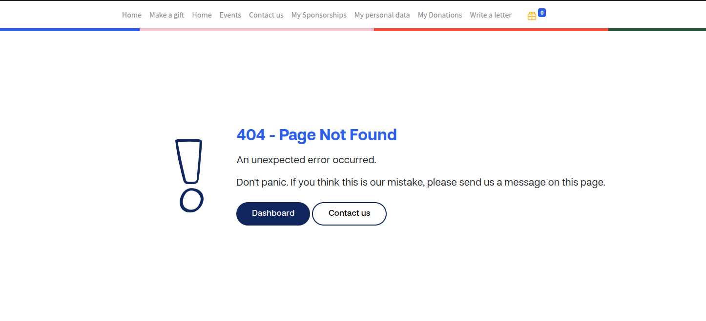

### Page 404 – mycompassion 2.0

L’objectif de cette tâche est de personnaliser la page d’erreur **404** afin qu’elle soit cohérente avec l’identité visuelle et l’expérience utilisateur de la plateforme *mycompassion 2.0*.  
Le but principal est d’offrir une page d’erreur claire et utile, tout en guidant l’utilisateur vers le tableau de bord de la plateforme plutôt que vers la page standard fournie par Odoo.

---
