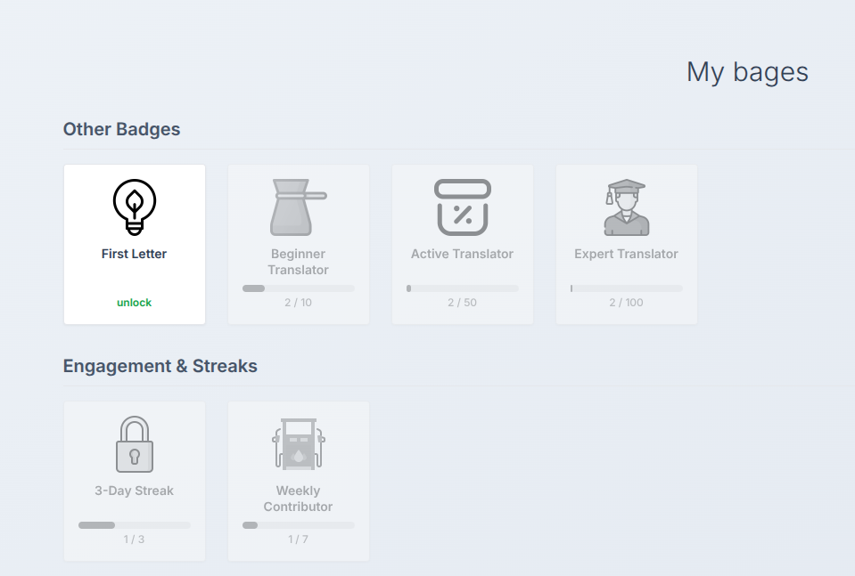

# Conception et spécification du système de badges

* **Technologies :** Odoo, Python, JavaScript, OWL, PostgreSQL
* **Date de réalisation :** [À compléter]
* **Durée :** [À compléter]
* **Lieu de réalisation :** Compassion Suisse, Rue Galilée 3, 1400 Yverdon-les-Bains
* **Note :** [À compléter]
* **Compétences opérationnelles acquises :** [À compléter]

## Description

Dans le cadre de l'amélioration de la plateforme de traduction, j'ai travaillé sur la conception fonctionnelle d'un **système de badges** destiné à introduire un système de gamification.

L'objectif est de motiver les traducteurs en récompensant leurs contributions et leur régularité. Les badges permettent aux utilisateurs de visualiser leurs accomplissements et leur progression.

Le système doit être transparent, cohérent, évolutif et capable de mettre à jour les informations en temps réel après les activités des utilisateurs.

**Travaux effectués :**

1. **Définition des catégories de badges :** J'ai participé à la définition de trois catégories principales :

    * **Badges de volume**, basés sur le nombre de traductions réalisées.
    * **Badges d'engagement**, basés sur la régularité de l'activité.
    * **Badges de campagne**, liés à des campagnes de traduction spécifiques.

2. **Définition des conditions de déblocage :** J'ai défini les règles permettant de déterminer automatiquement lorsqu'un utilisateur obtient un badge. Par exemple, un utilisateur peut obtenir un badge après avoir réalisé 10 traductions ou après avoir maintenu une série d'activité pendant plusieurs jours.

3. **Conception de la structure des données :** J'ai défini les informations nécessaires pour gérer les badges et leur attribution aux utilisateurs. Un modèle `Badge` contient notamment le nom, la description, la catégorie, le seuil et l'icône. Un modèle `UserBadge` permet d'enregistrer les badges obtenus par chaque utilisateur.

4. **Définition du système de progression :** La progression vers un badge est calculée dynamiquement à partir des statistiques actuelles de l'utilisateur. Par exemple, un utilisateur ayant réalisé 7 traductions sur les 10 nécessaires possède une progression de 70 %.

5. **Définition du cycle de vie des badges :** J'ai défini les différentes étapes d'un badge : verrouillé, en progression et débloqué. Lorsqu'une activité est réalisée, les statistiques sont mises à jour, les conditions sont évaluées et le badge est attribué si les conditions sont remplies.

6. **Définition du comportement de l'interface :** J'ai spécifié la manière dont les badges doivent être affichés dans le profil utilisateur. Les badges débloqués sont affichés normalement, tandis que les badges verrouillés sont grisés. Les badges en cours d'obtention affichent leur progression.

7. **Définition des règles de classement :** Les badges débloqués doivent apparaître en premier, suivis des badges en progression puis des badges verrouillés. Les badges sont ensuite regroupés par catégorie.

8. **Prévention des doublons :** J'ai défini une règle d'idempotence afin qu'un même badge ne puisse être attribué qu'une seule fois au même utilisateur, même si les conditions sont évaluées plusieurs fois.

9. **Définition des critères d'acceptation :** J'ai établi les critères permettant de vérifier que le système fonctionne correctement, notamment l'attribution des badges, le calcul de la progression, la cohérence entre le backend et l'interface et l'absence de doublons.

**Résultat :**

* Une spécification fonctionnelle complète du système de badges a été réalisée.
* Les différentes catégories et règles d'attribution ont été définies.
* La structure nécessaire à la gestion des badges et de leur attribution a été spécifiée.
* Le fonctionnement de la progression et de l'interface utilisateur a été défini.
* La conception permet d'ajouter de nouveaux types de badges à l'avenir sans devoir modifier fondamentalement le système existant.

## Aperçu 

