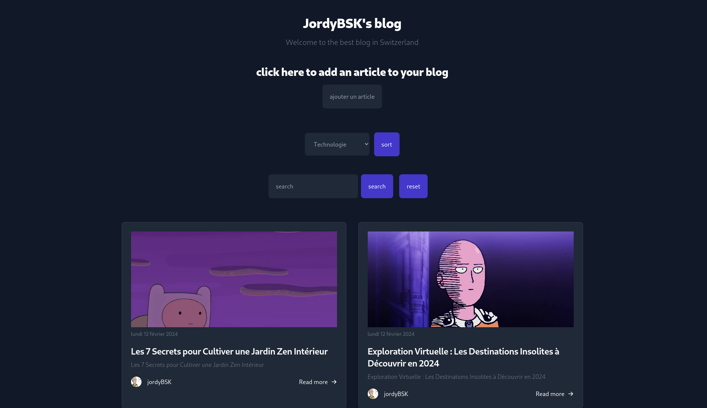

# BLOG PHP <Badge type="tip" text="twig" />

---

This Blog project offers a dynamic and intuitive platform for bloggers to share their ideas. Built with PHP and Twig, it combines robust functionality with elegant presentation. Whether you're an aspiring writer or a seasoned blogger, they give you the tools you need to create, manage and share compelling content.

Après avoir fait ma todo list en php comme premier projet utilisant slim et twig j'ai décider de realiser un blog personnel

j'ai utiliser slim pour permettre de manipuler l'url a ma guise et eviter des trop grande ligne de code 