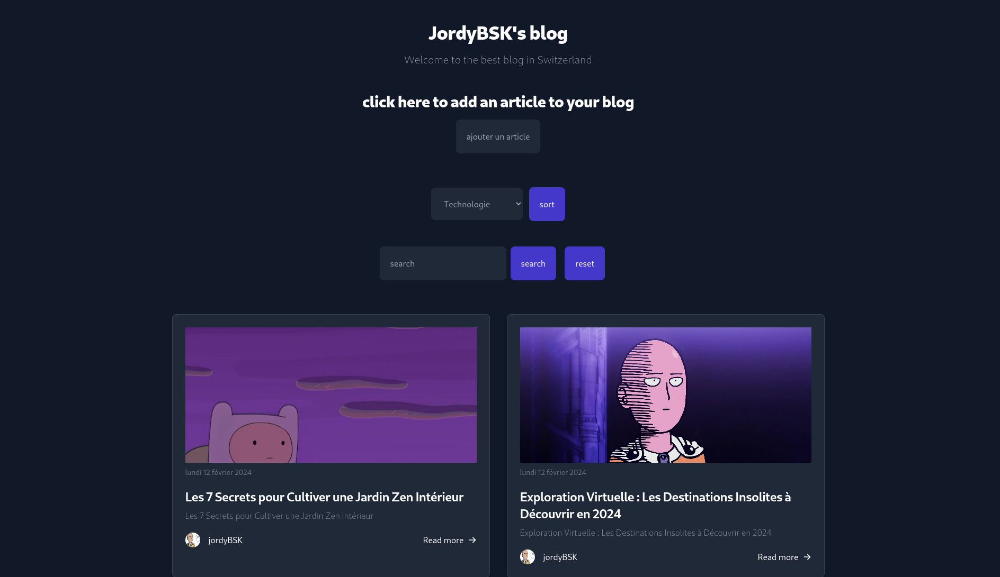

# Blog Personnel PHP <Badge type="tip" text="PHP / Twig / Slim" />

- **Technologies :** PHP, Twig, Slim Framework
- **Date de réalisation :** 02.02.2024
- **Durée :** 10 jours
- **Lieu de réalisation :** Jobtrek, Rue du Jura 11, 1004 Lausanne
- **Note :** [À compléter]
- **Compétences opérationnelles acquises :** a1, g1, g4, g5, g6

## Description
Ce projet de blog offre une plateforme dynamique et intuitive pour partager des idées. Construit avec PHP et Twig, il combine des fonctionnalités robustes avec une présentation élégante. Que vous soyez un écrivain en herbe ou un blogueur chevronné, il fournit les outils nécessaires pour créer, gérer et partager du contenu attrayant.

Après avoir fait ma todo list en PHP comme premier projet utilisant Slim et Twig, j'ai décidé de réaliser ce blog personnel. J'ai utilisé Slim pour manipuler l'URL à ma guise et éviter de trop grandes lignes de code, favorisant ainsi une architecture propre et modulaire.

## Aperçu / Liens
