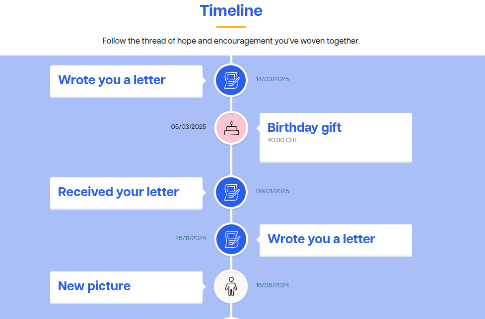

# Extension de la timeline pour les photos des enfants

- **Technologies :** SQL, Odoo, HTML, CSS
- **Date de réalisation :** 19.11.2025
- **Durée :** [À compléter]
- **Lieu de réalisation :** Compassion Suisse, Rue Galilée 3, 1400 Yverdon-les-Bains
- **Note :** [À compléter]
- **Compétences opérationnelles acquises :** a1, c1, c4, g1, g4, g5

## Description
L'objectif de cette fonctionnalité est d'afficher dans la timeline des enfants, en plus des lettres et des cadeaux, les photos associées à chaque enfant.

**Travaux effectués :**
1. **Modification de la vue SQL :** La vue SQL alimentant la timeline a été étendue pour inclure les données de la table `compassion_child_pictures`. Chaque photo est désormais transformée en un élément de la timeline avec sa date.
2. **Création des éléments de timeline :** Les photos apparaissent comme des items individuels. L’icône correspond à l’image, et le titre est « New photo ».
3. **Maintien du comportement existant :** L’ordre chronologique est respecté, cliquer sur une photo l'ouvre dans un nouvel onglet. Aucun impact sur les autres événements.

**Résultat :**
- Les photos s'intègrent de manière fluide dans la timeline.
- Les fonctionnalités existantes restent intactes.

## Aperçu / Liens
