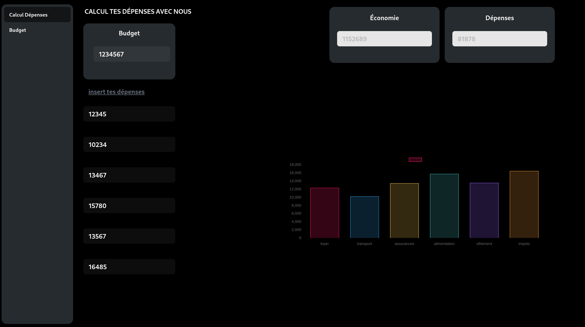

# Ecomaille <Badge type="tip" text="Js" />

---



Écomaille is a practical and useful site that uses graphical displays to help users manage their spending effectively,
plan their budget and avoid running out of money at the end of the month.

## Chart.js


dans ce projet j'ai utiliser Chart.js c'est une bibliothèque JavaScript open source gratuite pour la visualisation de
données a l'aide de graphique .

```javascript
const config = {
    type: 'bar',
    data: data,
    options: {
        responsive: true,
        plugins: {
            legend: {
                position: 'top',
            },
            title: {
                display: true,
                text: 'Chart.js Bar Chart'
            }
        }
    },
};
```