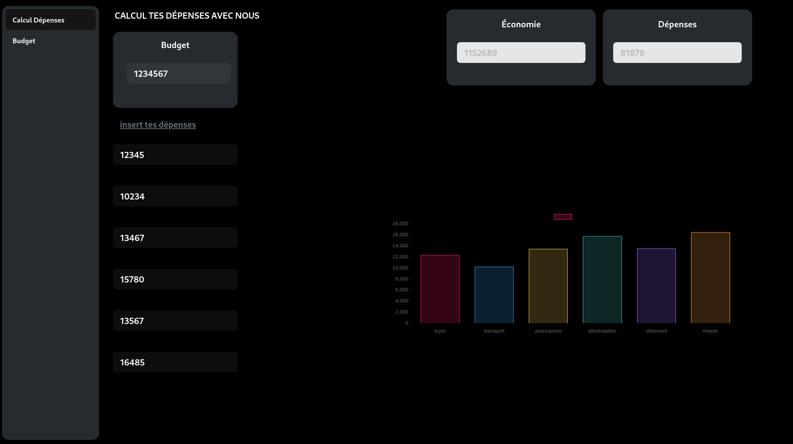

# Ecomaille <Badge type="tip" text="JavaScript / Chart.js" />

- **Technologies :** JavaScript, Chart.js
- **Date de réalisation :** 4 avril 2023
- **Durée :** 1 semaine
- **Lieu de réalisation :** Jobtrek, Rue du Jura 11, 1004 Lausanne
- **Note :** [À compléter]
- **Compétences opérationnelles acquises :** a1, g1, g2, g4, g5

## Description
Ecomaille est une application web conçue pour aider les utilisateurs à mieux gérer leur budget personnel de manière simple et visuelle. L’objectif principal du projet est de rendre la gestion financière plus accessible grâce à des graphiques clairs et interactifs.

Grâce à une interface intuitive, l’utilisateur peut ajouter ses revenus et ses dépenses, visualiser la répartition de son budget, et suivre son évolution financière pour éviter les dépassements de budget en fin de mois.

**Chart.js :**
Dans ce projet, j’ai utilisé **Chart.js**, une bibliothèque JavaScript open source permettant de créer des graphiques dynamiques et interactifs à partir de données. Chart.js est utilisé pour afficher la répartition des dépenses et donner une vision claire du budget global de l'utilisateur.

