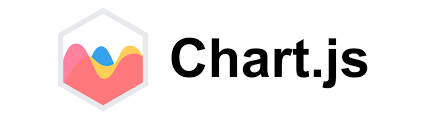

# Ecomaille – 4 avril 2023, Lausanne, Jobtrek <Badge type="tip" text="Js" />

---


## Présentation du projet

Ecomaille est une application web conçue pour aider les utilisateurs à mieux gérer leur budget personnel de manière simple et visuelle.  
L’objectif principal du projet est de rendre la gestion financière plus accessible grâce à des graphiques clairs et interactifs.

Grâce à une interface intuitive, l’utilisateur peut :

- ajouter ses revenus et ses dépenses
- visualiser la répartition de son budget
- suivre son évolution financière sur une période donnée
- éviter les dépassements de budget en fin de mois

L’idée est de transformer des données financières parfois complexes en informations faciles à comprendre.

---

## Fonctionnalités principales

### Gestion du budget
L’utilisateur peut saisir ses différentes sources de revenus ainsi que ses dépenses (loyer, nourriture, loisirs, etc.).  
Chaque entrée est enregistrée et utilisée pour les calculs automatiques du budget total.

### Visualisation des données
Les données sont transformées en graphiques afin de rendre l’analyse plus intuitive.

### Interface simple et accessible
L’application est pensée pour être utilisée rapidement, sans connaissances particulières en finance ou en informatique.

---

## Chart.js



Dans ce projet, j’ai utilisé **Chart.js**, une bibliothèque JavaScript open source permettant de créer des graphiques dynamiques et interactifs à partir de données.

Chart.js permet notamment de :

- créer des graphiques en barres, lignes, secteurs, etc.
- rendre les graphiques responsives (adaptés à tous les écrans)
- animer les transitions entre les données
- personnaliser facilement les couleurs, titres et légendes

Dans Ecomaille, Chart.js est utilisé pour afficher la répartition des dépenses et donner une vision claire du budget global.

---

## Exemple de configuration Chart.js

Voici un exemple de configuration utilisé dans le projet pour créer un graphique en barres :

```javascript
const config = {
    type: 'bar',
    data: data,
    options: {
        responsive: true,
        plugins: {
            legend: {
                position: 'top',
            },
            title: {
                display: true,
                text: 'Chart.js Bar Chart'
            }
        }
    },
};