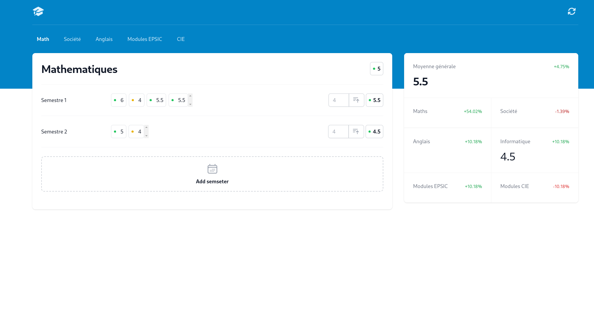

# Grade Calculator <Badge type="tip" text="React" />

- **Technologies :** React
- **Date de réalisation :** 23 Jan 2024
- **Durée :** [À compléter]
- **Lieu de réalisation :** Jobtrek, Rue du Jura 11, 1004 Lausanne
- **Note :** [À compléter]
- **Compétences opérationnelles acquises :** a1, g1, g2, g4, g5

## Description
Le projet **Grade Calculator (gradesView)** est une application conçue pour aider les étudiants à suivre et calculer leurs notes tout au long de l’année scolaire. L’objectif principal est de fournir un outil simple et clair permettant de visualiser l’évolution des résultats académiques en temps réel.

**Fonctionnalités principales :**
- Gestion des semestres : organiser son année scolaire de manière structurée.
- Gestion des branches et matières : ajouter plusieurs matières par semestre (reflète la réalité de l'EPSIC).
- Calcul automatique des moyennes : suivre ses performances et anticiper les résultats finaux.
- Suivi global des résultats : vue d’ensemble sur les notes actuelles et moyennes.

Ce projet m’a permis de mieux comprendre la gestion d’état en React, de manipuler des données dynamiques (notes, semestres, matières), et de structurer une application orientée utilisateur.

