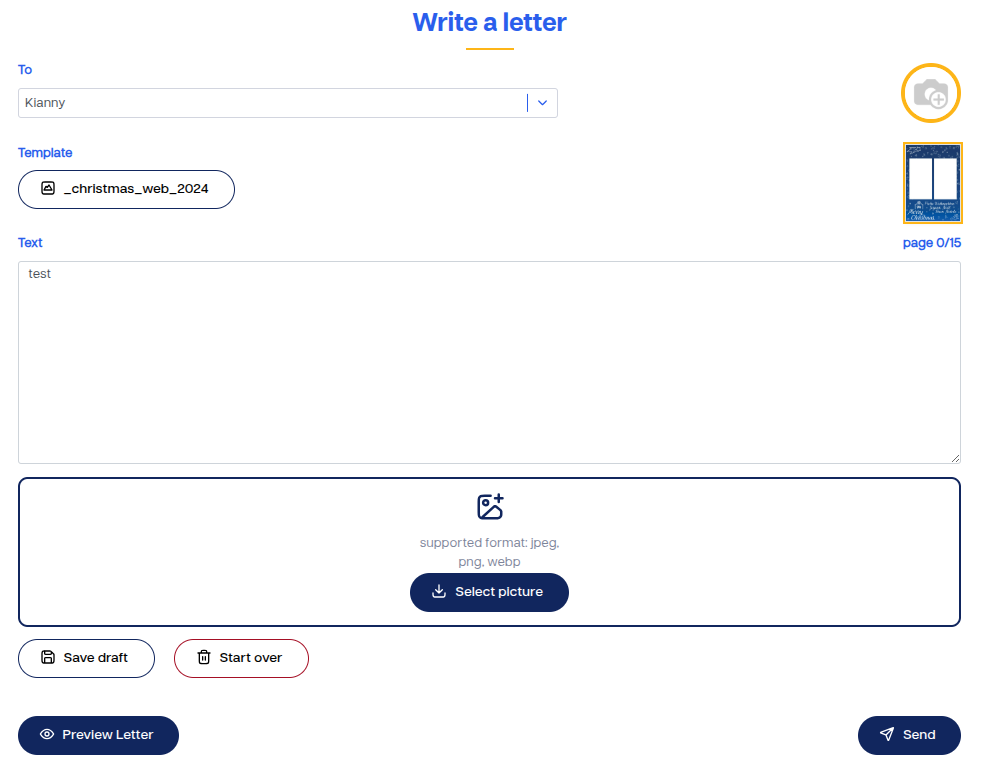

### Page Letters – mycompassion 2.0

L’objectif de ce module est de refondre la page Letters selon le nouveau design de la plateforme *mycompassion 2.0* et d’améliorer l’expérience de rédaction pour les utilisateurs.  
Le but principal est de permettre la gestion fluide des lettres — rédaction, sauvegarde, visualisation — tout en garantissant une interface moderne, responsive et simple d’utilisation.

---

### Fonctionnalités principales

Ce module permet de :

- **Écrire des lettres** dans une interface entièrement repensée, plus claire et ergonomique.  
- **Sauvegarder automatiquement le contenu** grâce à une fonctionnalité d’*autosave*, afin d’éviter toute perte de données durant la rédaction.  
- **Créer et reprendre des brouillons**, permettant à l’utilisateur de continuer une lettre non finalisée à tout moment.  
- **Prévisualiser les lettres** directement depuis la liste, sans quitter la page.  
- **Naviguer efficacement** entre les différentes sections (liste, contenu, aperçu) grâce à une structure de composants optimisée et responsive.

