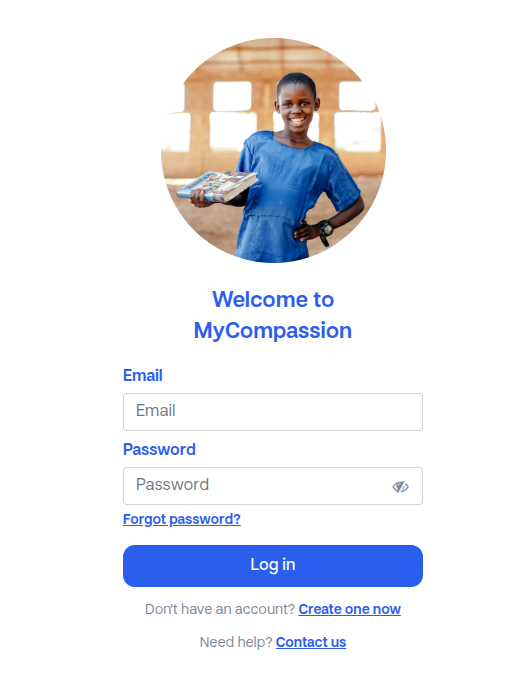

# Afficher/Masquer le mot de passe

- **Technologies :** Odoo, JavaScript, HTML/CSS
- **Date de réalisation :** 21.10.2024
- **Durée :** [À compléter]
- **Lieu de réalisation :** Compassion Suisse, Rue Galilée 3, 1400 Yverdon-les-Bains
- **Note (auto-évaluation) :** 5
- **Compétences opérationnelles acquises :** G2, G3, G4, G5, G6

## Description
Sur les formulaires de création de compte et de connexion, les utilisateurs ne pouvaient pas visualiser ce qu’ils saisissaient, entraînant des erreurs de saisie. L'objectif était d'améliorer l’expérience utilisateur en ajoutant une fonctionnalité d'affichage temporaire du mot de passe.

**Travaux effectués :**
1. **Ajout d’un bouton “œil” :** Permet de basculer la visibilité du champ de mot de passe de type `password` à `text`.
2. **Comportement sécurisé :** L’affichage ne modifie pas le comportement natif du formulaire et respecte les bonnes pratiques UX.
3. **Tests fonctionnels :** Vérification sur les formulaires de login et de signup, ainsi que sur différents navigateurs.

**Résultat :**
Expérience de saisie plus intuitive, réduction des erreurs de frappe tout en maintenant la sécurité.

## Aperçu
