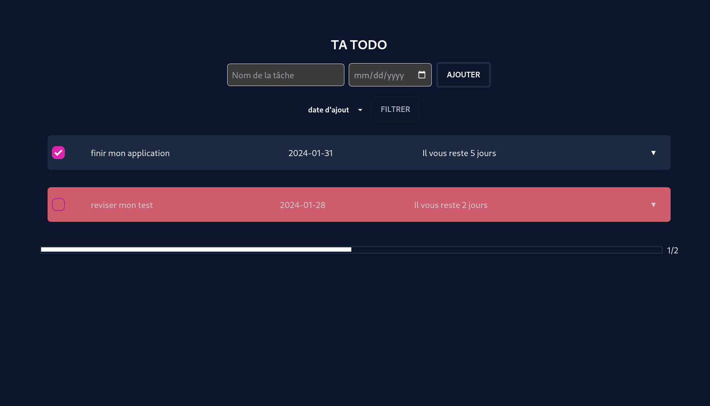

# Tout Doux (Todo PHP) <Badge type="tip" text="PHP / MySQL" />

- **Technologies :** PHP, MySQL, HTML/CSS
- **Date de réalisation :** 29.01.2024
- **Durée :** 4 jours
- **Lieu de réalisation :** jobtrek, Rue du Jura 11, 1004 Lausanne
- **Note :** [À compléter]
- **Compétences opérationnelles acquises :** c1, c2, c4, g1, g3, g4, g5

## Description
"Tout Doux" est une application de gestion de tâches (Todo List) utilisant PHP comme langage de programmation principal et MySQL pour la base de données. L'application permet aux utilisateurs de créer un compte, de se connecter en toute sécurité et de gérer leurs tâches quotidiennes (CRUD).

## Aperçu / Liens
